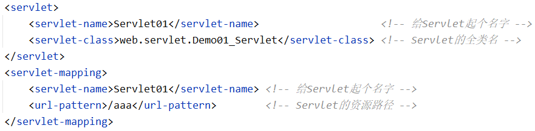
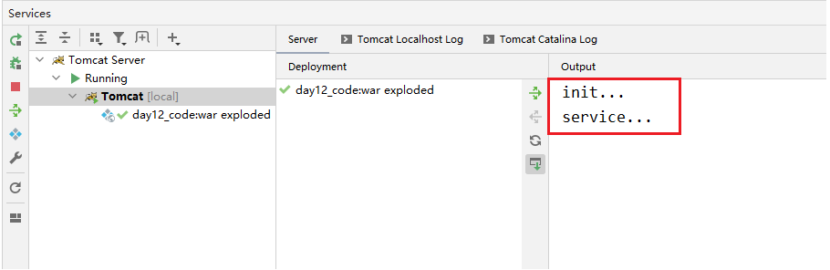

# day12_Tomcat、Servlet

## 一.web服务器软件

​	"BS架构模型" 就是：浏览器进程、web服务器软件进程之间的网络通信。那么这两个进程之间的网络通信是怎么建立的呢？通过在浏览器中输入URL网址："网络协议://web服务器ip地址: web服务器软件端口号/"，即可完成浏览器与web服务器软件之间的网络通信。

​	web服务器软件：可以接收浏览器的请求，对请求进行处理，然后作出响应返回给浏览器。所以我们可以将web项目(静态资源、动态资源)部署到web服务器软件中，通过浏览器与web服务器软件之间的网络通信，就可以让用户访问到这些web项目中的资源。所以web服务器软件就相当于是web项目的容器，安装了 "web服务器软件" 的计算机被称为 "web服务器"。

1.常见的java相关的web服务器软件

- webLogic：oracle公司的大型JavaEE服务器，支持所有的JavaEE规范，收费的
- webSphere：IBM公司的大型JavaEE服务器，支持所有的JavaEE规范，收费的
- JBOSS：JBOSS公司的大型JavaEE服务器，支持所有的JavaEE规范，收费的
- Tomcat：Apache基金组织的中小型JavaEE服务器，仅仅支持少量的JavaEE规范，开源免费的

2.Tomcat服务器的使用：见 ["参考\Tomcat服务器的使用.md"](Java视频教程\03_JavaWeb\day12_Tomcat、Servlet\参考\Tomcat服务器的使用.md)

#### 二.Servlet

​	web项目中的动态资源：所有用户访问，得到的结果可能不一样。那么这种动态资源的效果就要用一些具有逻辑性的Java代码来实现，而Java代码都是写在Java类当中的，所以web项目中的动态资源就是一些 "Java类"。但并不是所有的 "Java类" 都是动态资源，只有一些 "特殊的Java类" 才是动态资源。那Tomcat怎么分辨哪些 "Java类" 是动态资源、哪些 "Java类" 只是普通的类呢？

​	Servlet(server applet)：运行在服务器端的小程序。Servlet其实就是Java中的一个接口，它定义了 "Java类" 能够被Tomcat所识别到的规则。即：只有实现了 Servlet接口 的类才可以被Tomcat识别为动态资源，进而浏览器就可以通过和Tomcat的交互，访问到这些作为动态资源的Servlet实现类。所以Servlet接口的实现类才是web项目中的动态资源，这些动态资源也可以像静态资源那样直接被浏览器所访问。

​	严格来说，Servlet只是Sun公司推出的一套JavaWeb开发的规范，或者说是一套JavaWeb开发的技术标准，即一系列的接口。只有规范和标准并不能做任何事情，必须要有人去实现它。所谓实现Servlet规范，就是真正编写代码去实现Servlet规范中提到的各种功能，即：编写具体的实现类去实现这一系列的接口。目前常见的实现了Servlet规范的产品包括 Tomcat、Weblogic、WebSphere、Jboss 等web服务器，它们都被称为 "Servlet容器"。

#.注意：

​	(1).Servlet规范类似于JDBC规范，就是我们在 "day04_JDBC" 中所说的 "面向接口编程" 的思想。即：由Sun公司来制定接口规范，各个厂商编写具体的实现类去实现这些接口，我们只需要会调用这些接口中的方法即可，真正执行的还是具体实现类的代码。

​	(2).Servlet规范的这一系列接口，即为 javax.servlet 包中的API，此包并不在JDK中，而是在 "JavaEE(Java企业版)" 中。

1.Servlet的基本使用步骤

第一步：创建一个web项目，并将其部署到Tomcat中

第二步：将 apache-tomcat-8.5.31\lib 目录下的 servlet-api.jar 导入到项目中

第三步：在src目录下创建一个Servlet接口的实现类，并重写接口中的所有抽象方法（一般都将Servlet的实现类放在 src\web\servlet 目录下）

- init()：初始化Servlet对象的方法
- getServletConfig()：获取Servlet配置的方法
- service()：提供服务的方法
- getServletInfo()：获取Servlet的一些信息：版本、作者等
- destroy()：销毁Servlet对象的方法

第四步：在web.xml文件中配置Servlet

​	

第五步：启动Tomcat服务器，在浏览器中输入URL： http://localhost:8080/day12_code_war_exploded/aaa 来访问上述Servlet。日志窗口输出如下：

​	

上述Servlet的执行原理：

​	当Tomcat服务器接收到浏览器的请求后，会解析请求的URL路径，从URL中获取到要访问的Servlet资源路径，即："/aaa"。然后Tomcat会根据此资源路径查找 web.xml配置文件，查看是否有对应的 \<url-pattern> 标签体内容，如果有，则再根据两个 \<servlet-name> 标签的映射，找到对应的 \<servlet-class> 全类名。之后Tomcat会根据此全类名，将Servlet接口实现类的字节码文件加载进内存，并且创建其对象，调用 Service() 方法。

​	(注意：这个Servlet对象是Tomcat服务器所创建的，关闭Tomcat服务器，这个对象也就从内存中释放了)

2.Servlet对象的生命周期

(1).Servlet对象被创建：默认情况下，第一次使用浏览器访问Servlet时，Servlet对象就会被创建，并且Servlet对象在被创建时会调用一次 init() 方法。可以在 \<servlet> 标签下配置Servlet的创建时机

- 第一次被访问时创建对象：\<load-on-startup> 的值配置为负数 (默认值为 -1)
- 在服务器启动时创建对象：\<load-on-startup> 的值配置为0、正整数

(2).Servlet对象提供服务：浏览器每次访问Servlet时，Servlet对象都会调用一次 Service() 方法

(3).Servlet对象被销毁：Tomcat服务器关闭时，Servlet对象在内存中会被销毁。Servlet对象在被销毁之前，会调用一次 destroy() 方法，一般用于释放资源。只有在Tomcat服务器正常关闭时，才会调用 destroy() 方法

#.注意：Servlet是单例的，存在线程安全问题。Servlet对象在内存中只存在一个，即：当多个浏览器同时访问一个Servlet时，使用的是同一个Servlet对象

3.Servlet3.0 版本

​	Servlet3.0 以上的版本，不需要在web.xml文件中配置Servlet了，支持对Servlet进行注解配置：@WebServlet(urlPatterns = "资源路径", loadOnStartup = 数值)

(1).urlPatterns参数的配置方式

- urlPatterns可省略，可直接写为：@WebServlet("/bbb")
- 资源路径可以使用多层路径。例如：@WebServlet("/bbb/ccc")、@WebServlet("/bbb/ccc/ddd")
- 资源路径可以使用 "\*.xxx" 进行通配符匹配，此时路径中不能有 "/" 。例如：@WebServlet("\*.do")、@WebServlet("\*.action")
- 资源路径可以同时配置多个，访问其中任何一个均可。例如：@WebServlet({"/bbb", "/ccc", "/ddd"})

(2).loadOnStartup参数可不用配置，默认值为 -1
