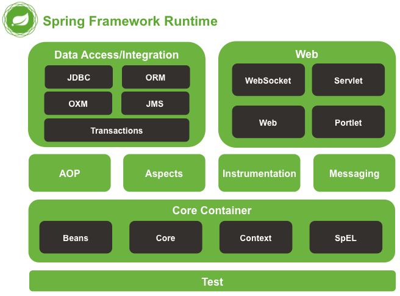
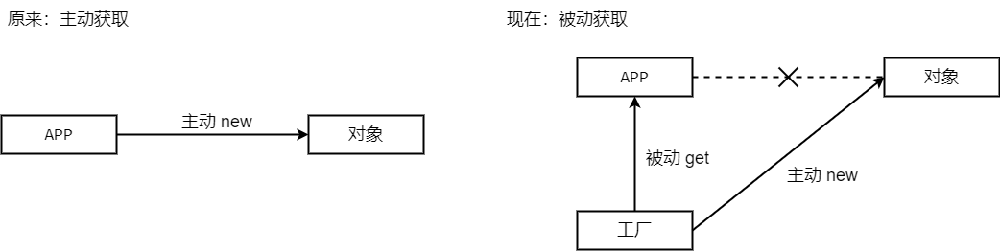
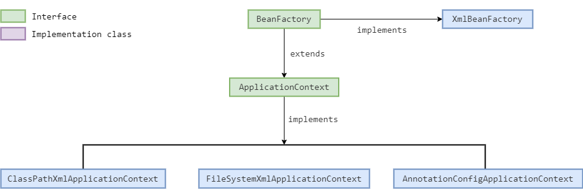

# day01_Spring框架概述、基于XML的SpringIOC


## 一.Spring框架概述

​	Spring是分层的JavaEE应用 full-stack(全栈) 轻量级开源框架，以 IOC(Inverse Of Control：控制反转) 和 AOP(Aspect Oriented Programming：面向切面编程) 为内核，提供了展现层Spring MVC、持久层Spring JDBC、业务层事务管理等众多的企业级应用技术，还能整合开源世界众多著名的第三方框架和类库，逐渐成为使用最多的JavaEE企业应用开源框架。



​	Spring框架具有以下优势：

- 方便解耦，简化开发：通过Spring提供的IOC容器，可以将对象间的依赖关系交由Spring进行控制，避免硬编码造成的程序耦合。用户不必再为单例模式类、属性文件解析等这些很底层的需求编写代码，可以更专注于上层应用。
- AOP编程的支持：通过Spring的AOP功能，方便进行面向切面的编程，许多不容易用传统OOP实现的功能可以通过AOP轻松应付。
- 声明式事务的支持：可以将我们从单调烦闷的事务管理代码中解脱出来，通过声明式方式灵活的进行事务的管理，提高开发效率和质量。
- 方便程序的测试：可以用非容器依赖的编程方式进行几乎所有的测试工作，测试不再是昂贵的操作，而是随手可做的事情。
- 方便集成各种优秀框架：Spring可以降低各种框架的使用难度，提供了对各种优秀框架(Struts、Hibernate、Hessian、Quartz等)的直接支持。
- 降低 JavaEE API 的使用难度：Spring对 JavaEE API(如JDBC、JavaMail、远程调用等) 进行了薄薄的封装层，使这些API的使用难度大为降低。
- Java源码是经典学习范例：Spring的源代码设计精妙、结构清晰、匠心独用，处处体现着大师对Java设计模式灵活运用以及对Java技术的高深造诣。它的源代码无疑是Java技术的最佳实践的范例。


## 二.IOC的概念和作用

​	程序的耦合：程序间的依赖关系。解耦：降低程序间的依赖关系，程序间的依赖关系不可能完全消除，只能降低。

### 1.程序耦合的案例分析1

​	在我们早期的JDBC程序中，可以采用 `new com.mysql.jdbc.Driver()` 一个mysql驱动对象的方式，进行注册驱动。如果项目中没有 "mysql-connector-java-5.1.6.jar" 驱动包，代码在编译期就会报错。即：JDBC程序在编译期就依赖于mysql驱动包中的Driver类，这就是程序的耦合。

```java
DriverManager.registerDriver(new com.mysql.jdbc.Driver()); // 使用DriverManager来注册驱动
```

​	为了降低JDBC程序中的耦合，我们可以采用反射的方式来创建mysql驱动对象，进行注册驱动。由于使用的是字符串来创建对象，所以即使项目中没有 "mysql-connector-java-5.1.6.jar" 驱动包，代码也可以正常进行编译，只不过在运行程序时会报错。即：编译期不依赖，运行时才依赖。通过这种方式，就降低了JDBC程序中的耦合。

```java
Class.forName("com.mysql.jdbc.Driver"); // 使用反射来注册驱动
```

​	同时也产生了一个新的问题，由于mysql驱动的全限定类名字符串是在代码中写死的，一旦要更换为Oracle等其他数据库，还是要修改源代码。此时可以将全限定类名字符串写在配置文件中，通过读取配置文件来获取要创建的对象的全限定类名。因此对于程序的解耦，具有以下思路：
​    (1).使用反射来创建对象，而避免使用new关键字
​    (2).通过读取配置文件来获取要创建的对象的全限定类名

### 2.程序耦合的案例分析2

​	在我们的MVC三层架构程序中，表现层在调用业务层的时候，需要new一个业务层接口的实现类。业务层在调用持久层的时候，需要new一个持久层接口的实现类。如果项目中删除了业务层接口实现类、持久层接口实现类，代码在编译期就会报错。即：三层架构程序在编译期就依赖于这两个实现类，这就是程序的耦合。

​	为了降低MVC三层架构程序中的耦合，我们可以采用上述程序解耦的思路。使用反射的方式来创建 业务层接口实现类、持久层接口实现类 的对象，并将这两个实现类的全限定类名写在配置文件中，通过读取配置文件来获取要创建的对象的全限定类名，这样就可以降低MVC三层架构程序中的耦合。

#### (1).工厂模式解耦

​	在程序中，用一个类专门去读取配置文件，并创建这两个实现类的对象。那么这个专门用来 读取配置文件、创建和获取对象的类 就被称为 "工厂类" ，这种模式就称为 "工厂模式解耦"。

#### (2).工厂模式解耦的优化

​	在上述工厂模式解耦的程序中，每调用一次 `BeanFactory.getBean("accountService")` 方法，就会创建一个 AccountServiceImpl 对象，说明通过工厂类创建出来的对象是 "多例的" 。但是在实际使用中，我们并不需要创建这么多的对象，所以我们希望通过 "工厂类" 创建出来的对象是 "单例的" ，即每个对象只有一个。我们可以在工厂类 BeanFactory 中，初始化一个 Map 来存储要创建的对象，然后读取配置文件中的所有全限定类名，创建所有相应的对象并存储到 Map 中，后续要使用哪个对象时直接去 Map 中获取即可，这样就实现了单例的模式。

### 3.控制反转-IOC(Inversion Of Control)

​	在工厂模式解耦的程序中，我们把用来存储对象的 Map 称为 "容器" ，把用来 读取配置文件、创建和获取对象的类 称为 "工厂" 。工厂负责创建对象并将其存储到容器中，负责给我们从容器中获取指定的对象，这个时候我们获取对象的方式发生了改变。原来：我们在获取对象时，都是采用new一个对象的方式，是主动获取的。现在：我们获取对象时，只需要从工厂处获取即可，由工厂为我们创建、获取对象，是被动获取的。



​	这种被动接收的方式来获取对象的思想就是 "控制反转-IOC" ，它是Spring框架的核心之一，就是把创建、控制对象的权力交给 SpringIOC，程序只需要从IOC的容器中获取对象进行使用即可。其实 SpringIOC 的实现原理与上述工厂模式解耦程序类似，就是在程序启动时读取配置文件，将配置文件中所配置的类的对象创建出来，并存储到IOC的容器中，供后续在程序中获取使用。所以IOC就是用来解除代码中的依赖关系，降低程序耦合的。


## 三.基于XML的SpringIOC

​	下面我们将使用SpringIOC来降低MVC三层架构程序中的耦合，并通过此入门程序来了解基于XML的SpringIOC的基本使用步骤。

第一步：创建maven工程，导入Spring框架的依赖

```xml
<dependency>
    <groupId>org.springframework</groupId>
    <artifactId>spring-context</artifactId>
    <version>5.0.2.RELEASE</version>
</dependency>
```

第二步：创建一个XML配置文件bean.xml，导入XML文件约束，并使用\<bean>标签来配置要创建的对象

```xml
<?xml version="1.0" encoding="UTF-8"?>
<beans xmlns="http://www.springframework.org/schema/beans"
       xmlns:xsi="http://www.w3.org/2001/XMLSchema-instance"
       xsi:schemaLocation="http://www.springframework.org/schema/beans
        http://www.springframework.org/schema/beans/spring-beans.xsd">
    <bean id="accountService" class="Demo03_SpringIOCBasedXML.Demo01_SpringIOCStarterProgramBasedXML.service.AccountServiceImpl"></bean>
    <bean id="accountDao" class="Demo03_SpringIOCBasedXML.Demo01_SpringIOCStarterProgramBasedXML.dao.AccountDaoImpl"></bean>
</beans>
```

\<bean>标签的属性介绍：

- id属性：为\<bean>标签的唯一标识，用于后续来获取要创建的对象
- class属性：为要创建的对象的全限定类名，用于反射创建对象

第三步：加载配置文件bean.xml，获取SpringIOC的核心容器对象，并从核心容器中获取bean对象

```java
public static void main(String[] args) {
    ApplicationContext ac = new ClassPathXmlApplicationContext("bean.xml");
    IAccountService accountService01 = (AccountServiceImpl) ac.getBean("accountService");
    IAccountService accountService02 = ac.getBean("accountService", AccountServiceImpl.class);
    accountService01.saveAccount();
    accountService02.saveAccount();
}
```

从核心容器中获取bean对象的getBean()方法，有以下两种重载形式供使用：

- `Object getBean(String var1)`：参数var1是\<bean>标签的id属性值accountService，返回值是Object类型，所以需要将返回值强制转换为AccountServiceImpl类型
- `<T> T getBean(String var1, Class<T> var2)`：参数var1是\<bean>标签的id属性值accountService，参数var2是AccountServiceImpl.class，此时会自动将返回值强制转换为AccountServiceImpl类型


### 1.SpringIOC的核心容器接口的使用



#### (1).ApplicationContext接口

​	ApplicationContext接口继承自BeanFactory接口，是对BeanFactory接口的完善，它可以使用以下三个实现类来创建核心容器对象：

- ClassPathXmlApplicationContext实现类：它可以加载类路径下的配置文件，配置文件必须在类路径下
- FileSystemXmlApplicationContext实现类：它可以加载磁盘任意路径下的配置文件，配置文件必须有访问权限
- AnnotationConfigApplicationContext实现类：它是用于读取注解来创建核心容器的

#### (2).BeanFactory接口

​	BeanFactory接口是SpringIOC核心容器的顶层接口，它可以使用 XmlBeanFactory 实现类来创建核心容器对象，XmlBeanFactory类需要一个Resource对象来实例化，Resource接口具有以下两个实现类：

- ClassPathResource实现类：它可以加载类路径下的配置文件为Resource对象，配置文件必须在类路径下
- FileSystemResource实现类：它可以加载磁盘任意路径下的配置文件为Resource对象，配置文件必须有访问权限

#### (3).ApplicationContext和BeanFactory的区别

​	BeanFactory接口在构建核心容器并加载XML配置文件时，无论XML中配置的是单例对象，还是多例对象，创建对象采用的都是延迟加载的方式。也就是说，什么时候根据\<bean>标签的id获取对象了，什么时候才真正的创建对象。ApplicationContext接口在构建核心容器并加载XML配置文件时，如果XML中配置的是单例对象，那么创建单例对象采用的是立即加载的方式。也就是说，只要一读取完配置文件就会创建配置文件中所配置的所有单例对象，并存储到核心容器中，以便后续使用。如果XML中配置的是多例对象，那么创建多例对象采用的是延迟加载的方式。由于单例对象更适合采用立即加载的方式，多例对象更适合采用延迟加载的方式，所以ApplicationContext接口比BeanFactory接口更加智能，也更加常用。

|                         | 单例对象 | 多例对象 |
| :---------------------: | :------: | :------: |
|    BeanFactory 接口     | 延迟加载 | 延迟加载 |
| ApplicationContext 接口 | 立即加载 | 延迟加载 |

### 2.SpringIOC对bean对象的管理

#### (1).bean对象的三种创建方式

①.使用默认构造函数创建对象：当\<bean>标签只有id、class属性，且没有其他属性和标签时，采用的就是默认构造函数来创建bean对象。此时如果类中没有默认构造函数，则对象无法创建

```xml
<bean id="accountService01" class="Demo03_SpringIOCBasedXML.Demo02_SpringIOCBeanObjectsManagement.service.AccountServiceImpl"></bean>
```

②.使用工厂类中的普通方法创建对象：使用某个类中的普通方法来创建对象。先配置工厂bean，factory-bean属性配置工厂bean的id，factory-method属性配置工厂类中的普通方法名

```xml
<bean id="instanceFactory" class="Demo03_SpringIOCBasedXML.Demo02_SpringIOCBeanObjectsManagement.factory.InstanceFactory"></bean>
<bean id="accountService02" factory-bean="instanceFactory" factory-method="getAccountService"></bean>
```

③.使用工厂类中的静态方法创建对象：使用某个类中的静态方法来创建对象。无需配置工厂bean，class属性配置工厂类的全限定类名，factory-method属性配置工厂类中的静态方法名

```xml
<bean id="accountService03" class="Demo03_SpringIOCBasedXML.Demo02_SpringIOCBeanObjectsManagement.factory.StaticFactory" factory-method="getAccountService"></bean>
```

#### (2).bean对象的作用范围

​	我们可以使用\<bean>标签的scope属性来指定bean对象的作用范围，scope属性具有以下取值：

①.scope="singleton"：单例对象（默认值）

②.scope="prototype"：多例对象

③.scope="request"：作用于web应用的请求范围

④.scope="session"：作用于web应用的会话范围

⑤.scope="global-session"：作用于集群环境的会话范围(全局会话范围)，当不是集群环境时，它就是session

#### (3).bean对象的生命周期

①.单例对象：scope="singleton"

​	出生：当容器创建时，对象就会被创建

​	活着：只要容器还在，对象就一直活着

​	死亡：容器一旦销毁，对象就会消亡

​	单例对象的生命周期与核心容器相同。例外：使用BeanFactory接口创建的核心容器，单例对象是在第一次获取该对象时创建的，而不是创建容器时。

②.多例对象：scope="prototype"

​	出生：当我们获取对象时Spring框架为我们创建

​	活着：对象只要是在使用过程中就一直活着

​	死亡：当对象长时间不用，且没有别的对象引用时，由Java的垃圾回收器回收

③.\<bean>标签的init-method属性：指定创建对象之后所执行的方法名称。\<bean>标签的destroy-method属性：指定销毁对象之前所执行的方法名称。

```xml
<bean id="accountService" class="Demo03_SpringIOCBasedXML.Demo02_SpringIOCBeanObjectsManagement.service.AccountServiceImpl" init-method="init" destroy-method="destroy"></bean>
```

```java
public class AccountServiceImpl implements IAccountService {
    
    public void init() {
        System.out.println("初始化对象...");
    }
    
    public void destroy() {
        System.out.println("销毁对象...");
    }
    
}
```

### 3.SpringIOC的依赖注入

​	当我们使用SpringIOC来创建bean对象时，可以通过配置文件为bean对象的各个属性进行初始化赋值，这就叫做：依赖注入-DI(Dependency Injection)。即：SpringIOC在创建bean对象时，会自动将配置文件中提前配置好的属性值注入到bean对象所依赖的属性中。能够自动注入的数据，分为以下三种类型：

​	①.基本数据类型、String类型

​	②.在SpringIOC核心容器中出现过的bean对象：配置文件中配置的bean类型、注解配置的bean类型

​	③.复杂类型、集合类型：Array数组、List集合、Set集合、Map集合、Properties集合

#### (1).构造函数注入

​	当\<bean>标签只有id、class属性，且没有其他属性和标签时，采用的就是默认构造函数来创建bean对象。当我们想使用类中的有参构造函数来创建bean对象，并将配置文件中提前配置好的属性值传递给有参构造函数来给成员变量赋值时，就要通过\<constructor-arg>标签来实现。\<constructor-arg>标签定义在\<bean>标签的内部，此标签具有以下两类属性：

①.用于指定给构造函数中哪个参数赋值的属性：

- type属性：用于指定构造函数中的参数的数据类型，可以是构造函数中某个、某些参数的数据类型，但type属性值必须是数据类型的全限定类名（模糊匹配）
- index属性：用于指定构造函数中的参数的索引位置，索引位置从0开始（精确匹配）
- name属性：用于指定构造函数中的参数的名称（精确匹配）

②.用于给构造函数中的参数赋值的属性：

- value属性：用于提供基本类型、String类型的数据
- ref属性：用于提供其他bean类型的数据，即在SpringIOC核心容器中出现过的bean对象

```xml
<!-- 构造函数注入：type属性 -->
<bean id="accountService01" class="Demo03_SpringIOCBasedXML.Demo03_SpringIOCDependencyInjection.service.AccountServiceImpl_01">
    <constructor-arg type="java.lang.String" value="迪丽热巴"></constructor-arg>
    <constructor-arg type="java.lang.Integer" value="18"></constructor-arg>
    <constructor-arg type="Demo03_SpringIOCBasedXML.Demo03_SpringIOCDependencyInjection.dao.IAccountDao" ref="accountDao01"></constructor-arg>
</bean>
<bean id="accountDao01" class="Demo03_SpringIOCBasedXML.Demo03_SpringIOCDependencyInjection.dao.AccountDaoImpl"></bean>

<!-- 构造函数注入：index属性 -->
<bean id="accountService02" class="Demo03_SpringIOCBasedXML.Demo03_SpringIOCDependencyInjection.service.AccountServiceImpl_01">
    <constructor-arg index="0" value="迪丽热巴"></constructor-arg>
    <constructor-arg index="1" value="18"></constructor-arg>
    <constructor-arg index="2" ref="accountDao02"></constructor-arg>
</bean>
<bean id="accountDao02" class="Demo03_SpringIOCBasedXML.Demo03_SpringIOCDependencyInjection.dao.AccountDaoImpl"></bean>

<!-- 构造函数注入：name属性 -->
<bean id="accountService03" class="Demo03_SpringIOCBasedXML.Demo03_SpringIOCDependencyInjection.service.AccountServiceImpl_01">
    <constructor-arg name="name" value="迪丽热巴"></constructor-arg>
    <constructor-arg name="age" value="18"></constructor-arg>
    <constructor-arg name="accountDao" ref="accountDao03"></constructor-arg>
</bean>
<bean id="accountDao03" class="Demo03_SpringIOCBasedXML.Demo03_SpringIOCDependencyInjection.dao.AccountDaoImpl"></bean>
```

#### (2).set方法注入

​	当我们想使用默认构造函数来创建bean对象，并通过调用set方法来给部分、全部成员变量赋值时，就要通过\<property>标签来实现。\<property>标签定义在\<bean>标签的内部，此标签具有以下两类属性：

①.用于指定调用哪个set方法的属性：

- name属性：用于指定所调用的set方法名称，name属性值为 "set方法名称去除set单词后的小写形式"

②.用于给set方法传递参数的属性：

- value属性：用于提供基本类型、String类型的数据
- ref属性：用于提供其他bean类型的数据，即在SpringIOC核心容器中出现过的bean对象

```xml
<bean id="accountService" class="Demo03_SpringIOCBasedXML.Demo03_SpringIOCDependencyInjection.service.AccountServiceImpl_02">
    <property name="name" value="迪丽热巴"></property>
    <property name="age" value="18"></property>
    <property name="accountDao" ref="accountDao"></property>
</bean>
<bean id="accountDao" class="Demo03_SpringIOCBasedXML.Demo03_SpringIOCDependencyInjection.dao.AccountDaoImpl"></bean>
```

#.注意：

​	a.使用set方法注入时，类中必须含有默认构造函数，否则将无法创建bean对象。

​	b.使用构造函数注入的弊端在于，必须在配置文件中给构造函数中的所有参数进行配置赋值，才能成功创建bean对象。由于set方法注入可以自由地选择给哪些成员变量赋值，所以set方法注入更加常用。

#### (3).复杂类型、集合类型的数据注入

​	复杂类型、集合类型的数据一般包含：Array数组、List集合、Set集合、Map集合、Properties集合。由于set方法注入更加常用，下面我们就用set方法来对这些复杂类型、集合类型的数据进行注入。在配置文件中对这些类型的数据进行注入的时候，对不同的数据类型，在\<property>标签中使用相应的子标签进行数据注入即可。

```xml
<bean id="accountService" class="Demo03_SpringIOCBasedXML.Demo03_SpringIOCDependencyInjection.service.AccountServiceImpl_03">
    
    <!-- ①.Array数组注入：使用<array>标签 -->
    <property name="array">
        <array>
            <value>AAA</value>
            <value>BBB</value>
        </array>
    </property>
    
    <!-- ②.List集合注入：使用<list>标签 -->
    <property name="list">
        <list>
            <value>AAA</value>
            <value>BBB</value>
        </list>
    </property>
    
    <!-- ③.Set集合注入：使用<set>标签 -->
    <property name="set">
        <set>
            <value>AAA</value>
            <value>BBB</value>
        </set>
    </property>
    
    <!-- ④.Map集合注入：使用<map>标签 -->
    <property name="map">
        <map>
            <entry key="1" value="AAA"></entry>
            <entry key="2">
                <value>BBB</value>
            </entry>
        </map>
    </property>
    
    <!-- ⑤.Properties集合注入：使用<props>标签 -->
    <property name="properties">
        <props>
            <prop key="1">AAA</prop>
            <prop key="2">BBB</prop>
        </props>
    </property>
</bean>
```

#.注意：

​	a.在使用\<map>标签进行数据注入时，可以使用\<entry>标签的value属性进行赋值，也可以使用\<entry>标签中的\<value>标签进行赋值，两种方式均可。

​	b.结构相同的数据类型，标签可以互换。用于给 "List结构集合(Array、List、Set)" 注入的标签有：\<array>、\<list>、\<set>，用于给 "Map结构集合(Map、Properties)" 注入的标签有:\<map>、\<props>。即：Array数组、List集合、Set集合类型的数据，可以使用\<array>、\<list>、\<set>中的任一标签进行数据注入；Map集合、Properties集合类型的数据，可以使用\<map>、\<props>中的任一标签进行数据注入。

​	c.复杂类型、集合类型的数据也可以使用构造函数注入，对不同的数据类型，在\<constructor-arg>标签中使用相应的子标签进行数据注入即可。                  	 
