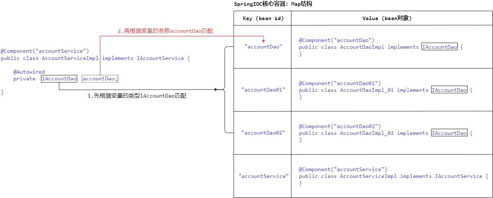

#   day02_基于注解的SpringIOC、SpringIOC的案例


## 一.基于注解的SpringIOC

​	学习基于注解的SpringIOC，首先大家脑海里得有一个认知，即注解配置和XML配置要实现的功能都是一样的，都是要降低程序间的耦合，只是配置的形式不一样而已。下面我们来介绍基于注解的SpringIOC的入门程序。

第一步：创建maven工程，导入Spring框架的依赖

```xml
<dependency>
	<groupId>org.springframework</groupId>
	<artifactId>spring-context</artifactId>
	<version>5.0.2.RELEASE</version>
</dependency>
```

第二步：创建一个XML配置文件bean.xml，导入含有 "context命名空间和约束" 的XML文件约束，并使用 \<context:component-scan> 标签来配置Spring在创建核心容器时要扫描的包

```xml
<?xml version="1.0" encoding="UTF-8"?>
<beans xmlns="http://www.springframework.org/schema/beans"
       xmlns:xsi="http://www.w3.org/2001/XMLSchema-instance"
       xmlns:context="http://www.springframework.org/schema/context"
       xsi:schemaLocation="http://www.springframework.org/schema/beans
        http://www.springframework.org/schema/beans/spring-beans.xsd
        http://www.springframework.org/schema/context
        http://www.springframework.org/schema/context/spring-context.xsd">
    
    <context:component-scan base-package="Demo01_SpringIOCBasedAnnotation"></context:component-scan>
    
</beans>
```

第三步：使用 @Component(value = "") 注解来配置要创建的bean对象，value属性用于指定bean对象的id

```java
@Component(value = "accountService")
public class AccountServiceImpl implements IAccountService {
    
    private IAccountDao accountDao = new AccountDaoImpl();
    
    @Override
    public void saveAccount() {
        accountDao.saveAccount();
    }
}
```

第四步：加载配置文件bean.xml，获取SpringIOC的核心容器对象，并从核心容器中获取bean对象

```java
public static void main(String[] args) {
    ApplicationContext ac = new ClassPathXmlApplicationContext("bean.xml");
    IAccountService accountService = ac.getBean("accountService", AccountServiceImpl.class);
    accountService.saveAccount();
}
```

​	在上述入门程序中，在创建SpringIOC的核心容器对象时，Spring通过XML配置文件中的\<context:component-scan>标签获取到要扫描的包路径，然后会扫描此包路径下所有使用注解配置的bean对象，通过反射将其创建出来并存入SpringIOC核心容器中。由此可见，只是bean对象的配置形式发生了变化，但是注解配置和XML配置要实现的功能都是一样的。


### 1.用于创建对象的注解

​	他们的作用就和在XML配置文件中编写一个\<bean>标签实现的功能是一样的，相当于：\<bean id="" class="">\</bean>，用于配置一个bean对象。

#### (1).@Component注解

​	@Component注解用于配置一个bean对象，并将其存入SpringIOC核心容器中，value属性用于指定bean对象的id。当value属性省略不写时，其默认值是 "当前类名且首字母改小写"。所以以下三种写法均可：

```java
@Component(value = "accountService")
public class AccountServiceImpl implements IAccountService {
}
```

```java
@Component("accountService") // 当注解中只有一个value属性时，value关键字在赋值时可以省略
public class AccountServiceImpl implements IAccountService {
}
```

```java
@Component // 当value属性省略不写时，bean的id默认为 "accountServiceImpl"
public class AccountServiceImpl implements IAccountService {
}
```

#### (2).@Controller、@Service、@Repository注解

​	以上三个注解都是@Component的衍生注解，其作用和属性与@Component注解是一模一样的，他们三个是Spring框架为我们提供明确的三层架构所使用的注解，使我们的三层架构的对象更加清晰。其中：@Controller注解一般用于表现层、@Service注解一般用于业务层、@Repository注解一般用于持久层。

```java
// @Component("client")
@Controller("client")
public class Client {
}
```

```java
// @Component("accountService")
@Service("accountService")
public class AccountServiceImpl implements IAccountService {
}
```

```java
// @Component("accountDao")
@Repository("accountDao")
public class AccountDaoImpl implements IAccountDao {
}
```

### 2.用于注入数据的注解

​	他们的作用就和在XML配置文件的\<bean>标签中编写一个\<property>标签实现的功能是一样的，相当于：\<property name="" value="">\</property>，用于数据注入。

#### (1).@Autowired注解

​	@Autowired注解会按照数据类型来进行自动数据注入。它既可以用来配置成员变量，也可以用来配置成员方法。

##### ①.配置成员变量

​	当@Autowired注解用于配置成员变量时，即：在创建bean对象并对成员变量进行数据注入时，会去SpringIOC的核心容器中匹配与变量类型相同的bean对象进行自动数据注入。

- 如果核心容器中没有任何bean对象的类型和要注入的变量的类型相同，数据注入就会报错。
- 如果核心容器中只有唯一一个bean对象的类型和要注入的变量的类型相同，就可以注入成功。
- 如果核心容器中有多个bean对象的类型和要注入的变量的类型相同，就会优先注入bean对象id与变量名称相同的那个bean对象。如果这些bean对象id与变量名称都不相同，那么数据注入也会报错。图解如下：

##### ②.配置成员方法

​	当@Autowired注解用于配置成员方法时，会对方法的参数进行自动数据注入，注入规则与成员变量相同，并且在bean对象创建之后会自动调用一次该方法。

```java
@Component("accountService")
public class AccountServiceImpl implements IAccountService {

    @Autowired
    public void init(IAccountDao accountDao) {
        System.out.println(accountDao);
    }

}
```

#### (2).@Qualifier注解

​	@Qualifier注解用于在@Autowired注解自动注入的基础之上，再指定bean的id进行数据注入，它只有一个value属性用于指定注入bean的id。其实就是直接指定bean的id进行数据注入，只不过要在@Autowired自动注入的基础上才能使用该注解。同理，@Qualifier注解既可以用来配置成员变量，也可以用来配置成员方法。

##### ①.配置成员变量

```java
@Component("accountService")
public class AccountServiceImpl implements IAccountService {
    
    @Autowired
    @Qualifier("accountDao01")
    private IAccountDao accountDao;

}
```

##### ②.配置成员方法

```java
@Component("accountService")
public class AccountServiceImpl implements IAccountService {
    
	// 配置成员方法
    @Autowired
    @Qualifier("accountDao01")
    public void init(IAccountDao accountDao) {
        System.out.println(accountDao);
    }
    
    // 配置成员方法的另一种写法
    @Autowired
    public void init(@Qualifier("accountDao01") IAccountDao accountDao) {
        System.out.println(accountDao);
    }

}
```

#.注意：

​	@Autowired、@Qualifier注解结合使用时：如果此时核心容器中只有唯一一个bean对象的类型和要注入的变量的类型相同，但是 "这个bean对象的id" 和 "@Qualifier("beanID")注解所指定的id" 是不一样的，也是无法注入成功的。说明这俩注解结合使用时，就是在指定bean的id进行数据注入，只要容器中没有指定id的bean对象，就无法注入成功。

#### (3).@Resource注解

​	@Resource注解用于代替 "@Autowired、@Qualifier注解结合使用" 的情况，它可以直接指定bean的id进行数据注入，无须结合其他注解使用。name属性用于指定注入bean的id，当name属性省略不写时，其默认值就是变量名称。同理，@Resource注解既可以用来配置成员变量，也可以用来配置成员方法。

##### ①.配置成员变量

```java
@Component("accountService")
public class AccountServiceImpl implements IAccountService {

    @Resource(name = "accountDao01")
    @Resource // 当name属性省略不写时，所指定的bean的id默认为变量名称 "accountDao"
    private IAccountDao accountDao;
    
}
```

##### ②.配置成员方法

```java
@Component("accountService")
public class AccountServiceImpl implements IAccountService {

    @Resource(name = "accountDao01")
    @Resource // 当name属性省略不写时，所指定的bean的id默认为变量名称 "accountDao"
    public void init(IAccountDao accountDao) {
        System.out.println(accountDao);
    }
    
}
```

#.注意：

​	@Resource注解在使用时：如果此时核心容器中只有唯一一个bean对象的类型和要注入的变量的类型相同，但是 "这个bean对象的id" 和 "@Resource(name = "beanID")注解所指定的id" 是不一样的，也是可以注入成功的。这一点有别于@Autowired、@Qualifier注解结合使用的情况。

#### (4).@Value注解

​	复杂类型、集合类型的数据注入只能通过XML配置来实现，无法使用注解实现。并且上述三个注解都只能注入其他bean类型的数据，而基本类型和String类型无法使用上述注解实现。@Value注解就是用于注入基本类型和String类型的数据，它只有一个value属性用于指定注入的数据值。

​	①.使用具体的数据值进行赋值

​	②.使用Spring的EL表达式(SpEL表达式)进行赋值，SpEL表达式的格式为："${表达式}"。（SpEL表达式只能去Spring所指定的地方去获取数据，见：[@PropertySource注解](#2propertysource注解)）

```java
@Component("accountService")
public class AccountServiceImpl implements IAccountService {

    @Value("18")
    private int age;

    @Value("迪丽热巴")
    private String name;
    
	@Value("${表达式}")
    private String var1;

}
```

### 3.用于改变作用范围的注解

​	@Scope注解用于改变bean对象的作用范围，就和在bean标签中使用scope属性实现的功能是一样的，相当于：\<bean id="" class="" scope="">\</bean>。value属性用于指定bean对象的作用范围，常用取值和scope属性一样：singleton(单例对象)、prototype(多例对象)等。

​	①.当不使用@Scope注解时，bean对象默认也是单例对象

​	②.当value属性省略不写时，其默认值是单例对象singleton

```java
@Component("accountService") // 当不使用@Scope注解时，bean对象默认也是单例对象
public class AccountServiceImpl implements IAccountService {
}

@Component("accountService")
@Scope() // 当value属性省略不写时，其默认值是单例对象singleton
public class AccountServiceImpl implements IAccountService {
}

@Component("accountDao")
@Scope("prototype")
public class AccountDaoImpl implements IAccountDao {
}
```

### 4.用于生命周期的注解

​	他们的作用就和在bean标签中使用init-method、destroy-method属性实现的功能是一样的，相当于：\<bean id="" class="" init-method="" destroy-method="">\</bean>，用于指定bean对象创建、销毁时所执行的方法。

- @PostConstruct注解：用于指定对象创建之后所执行的方法
- @PreDestroy注解：用于指定对象销毁之前所执行的方法

```java
@Component("accountService")
public class AccountServiceImpl implements IAccountService {

    @PostConstruct
    public void init() {
        System.out.println("初始化对象...");
    }

    @PreDestroy
    public void destroy() {
        System.out.println("销毁对象...");
    }

}
```

#.注意：@Resource、@PostConstruct、@PreDestroy这三个注解其实不是Spring提供的，而是Java自己的注解。但是这三个注解在JDK1.8之后就被移除了，如果当前JDK版本大于1.8，那么在使用这三个注解时，需要单独引入以下jar包的依赖。

```xml
<dependency>
    <groupId>javax.annotation</groupId>
    <artifactId>javax.annotation-api</artifactId>
    <version>1.3.2</version>
</dependency>
```


## 二.SpringIOC的案例

### 1.使用SpringIOC实现对账户表的CRUD-基于XML配置

​	[待学完JDBC、DBUtils、ThreadLocal后再进行补充]

### 2.使用SpringIOC实现对账户表的CRUD-基于注解配置

​	[待学完JDBC、DBUtils、ThreadLocal后再进行补充]

### 3.使用SpringIOC实现对账户表的CRUD-基于纯注解配置

​	在上述 "使用SpringIOC实现对账户表的CRUD-基于注解配置" 的案例中，我们依然离不开Spring的bean.xml配置文件，那么能不能不写这个bean.xml，所有配置都用注解来实现呢？我们发现，之所以我们现在离不开bean.xml配置文件，是因为有两个地方仍然需要XML进行配置：

​	①.需要使用 \<context:component-scan> 标签来配置Spring在创建核心容器时要扫描的包

​	②.需要使用 \<bean> 标签来配置处于jar包中的类：QueryRunner、ComboPooledDataSource

```xml
<context:component-scan base-package="Demo02_SpringIOCCase.Demo02_SpringIOCForAccountCRUDBasedAnnotation"></context:component-scan>

<bean id="runner" class="org.apache.commons.dbutils.QueryRunner" scope="prototype">
    <constructor-arg name="ds" ref="dataSource"></constructor-arg>
</bean>

<bean id="dataSource" class="com.mchange.v2.c3p0.ComboPooledDataSource">
    <property name="driverClass" value="com.mysql.jdbc.Driver"></property>
    <property name="jdbcUrl" value="jdbc:mysql://localhost:3306/05_Spring"></property>
    <property name="user" value="root"></property>
    <property name="password" value="root"></property>
</bean>
```

​	下面我们就来介绍，在Spring中如何使用注解来实现上述两个功能，从而让我们不再需要使用bean.xml配置文件，实现基于纯注解配置的SpringIOC。

#### (1).@Configuration、@ComponentScan注解

​	①.@Configuration注解：用于指定当前类是一个配置类，它的作用和bean.xml是一样的。

​	②.@ComponentScan注解：用于指定Spring在创建核心容器时要扫描的包，它的作用和 \<context:component-scan> 标签是一样的。basePackages、value属性是一个`String[]`数组，用于指定创建核心容器时要扫描的包路径，可以配置多个包路径。

```java
@Configuration
@ComponentScan(basePackages = "Demo02_SpringIOCCase.Demo03_SpringIOCForAccountCRUDBasedPureAnnotation")
public class SpringConfiguration {
}

@Configuration
@ComponentScan(value = "Demo02_SpringIOCCase.Demo03_SpringIOCForAccountCRUDBasedPureAnnotation") // value属性、basePackages属性的作用和用法一样
public class SpringConfiguration {
}

@Configuration
@ComponentScan("Demo02_SpringIOCCase.Demo03_SpringIOCForAccountCRUDBasedPureAnnotation") // basePackages、value关键字可以省略不写
public class SpringConfiguration {
}
```

#### (2).@Bean注解

​	@Bean注解可以配置在成员方法上，具有以下两个作用：

①.创建bean对象：把当前方法的返回值作为bean对象存入SpringIOC容器中。name属性用于指定bean对象的id，当name属性省略不写时，默认值是当前方法的名称。

②.自动注入方法参数：如果@Bean注解配置的方法有参数，那么Spring会去容器中查找有没有可用的bean对象，查找方式和 "按照类型自动注入的@Autowired注解" 是一样的。

```java
@Configuration
@ComponentScan("Demo02_SpringIOCCase.Demo03_SpringIOCForAccountCRUDBasedPureAnnotation")
public class SpringConfiguration {

    @Bean(name = "runner")
    public QueryRunner createQueryRunner(DataSource dataSource) {
        return new QueryRunner(dataSource);
    }

    @Bean(name = "dataSource")
    public DataSource createDataSource() {
        ComboPooledDataSource ds = new ComboPooledDataSource();
        try {
            ds.setDriverClass("com.mysql.jdbc.Driver");
            ds.setJdbcUrl("jdbc:mysql://localhost:3306/05_Spring");
            ds.setUser("root");
            ds.setPassword("root");
        } catch (PropertyVetoException e) {
            throw new RuntimeException(e);
        }
        return ds;
    }

}
```

#.注意：

- @Scope注解的另一种用法：可以和@Bean注解一起配置在方法上进行使用，用于改变bean对象的作用范围

  ```java
  @Configuration
  @ComponentScan("Demo02_SpringIOCCase.Demo03_SpringIOCForAccountCRUDBasedPureAnnotation")
  public class SpringConfiguration {
  
      @Bean(name = "runner")
      @Scope("prototype")
      public QueryRunner createQueryRunner(DataSource dataSource) {
          return new QueryRunner(dataSource);
      }
  
  }
  ```

- @Qualifier注解的另一种用法：可以和@Bean注解一起使用，用于指定bean的id来注入方法参数

  ```java
  @Configuration
  @ComponentScan("Demo02_SpringIOCCase.Demo03_SpringIOCForAccountCRUDBasedPureAnnotation")
  public class SpringConfiguration {
  
      @Bean(name = "runner")
      @Scope("prototype")
      public QueryRunner createQueryRunner(@Qualifier("dataSource01") DataSource dataSource) {
          return new QueryRunner(dataSource);
      }
  
      @Bean(name = "dataSource01")
      public DataSource createDataSource01() {
          ComboPooledDataSource ds = new ComboPooledDataSource();
          try {
              ds.setDriverClass("com.mysql.jdbc.Driver");
              ds.setJdbcUrl("jdbc:mysql://localhost:3306/05_Spring");
              ds.setUser("root");
              ds.setPassword("root");
          } catch (PropertyVetoException e) {
              throw new RuntimeException(e);
          }
          return ds;
      }
  
      @Bean(name = "dataSource02")
      public DataSource createDataSource02() {
          ComboPooledDataSource ds = new ComboPooledDataSource();
          try {
              ds.setDriverClass("com.mysql.jdbc.Driver");
              ds.setJdbcUrl("jdbc:mysql://localhost:3306/05_Spring");
              ds.setUser("root");
              ds.setPassword("root");
          } catch (PropertyVetoException e) {
              throw new RuntimeException(e);
          }
          return ds;
      }
  
  }
  ```

#### (3).AnnotationConfigApplicationContext实现类

​	在使用注解配置实现上述两个功能后，我们已经实现基于纯注解配置的SpringIOC了，bean.xml配置文件也已经不再需要了，所以此时创建核心容器对象需要使用AnnotationConfigApplicationContext实现类，它是用于加载@Configuration配置类来创建核心容器的。

​	①.使用AnnotationConfigApplicationContext来创建核心容器对象时，可以传入一个、多个@Configuration配置类.class

​	②.使用@Configuration配置类.class创建核心容器对象时，此时配置类的@Configuration注解可以省略不写

```java
ApplicationContext ac = new AnnotationConfigApplicationContext(SpringConfiguration.class);                                     // 传入一个配置类.class
ApplicationContext ac = new AnnotationConfigApplicationContext(SpringConfiguration01.class, SpringConfiguration02.class, ...); // 传入多个配置类.class
```

### 4.SpringIOC的其他注解介绍

#### (1).@Import注解

​	@Import注解用于指定其他配置类的字节码，有@Import注解的类就是父配置类，而导入的都是子配置类。子配置类中无需再写@Configuration、@ComponentScan注解，此时使用AnnotationConfigApplicationContext来创建核心容器时，只需加载父配置类.class即可。

```java
@Configuration
@ComponentScan("Demo02_SpringIOCCase.Demo04_SpringIOCOtherAnnotation")
@Import(JDBCConfig.class)
public class SpringConfiguration {	// 父配置类SpringConfiguration
}

public class JDBCConfig {		   // 子配置类JDBCConfig

    @Bean(name = "runner")
    @Scope("prototype")
    public QueryRunner createQueryRunner(DataSource dataSource) {
        return new QueryRunner(dataSource);
    }

    @Bean(name = "dataSource")
    public DataSource createDataSource() {
        ComboPooledDataSource ds = new ComboPooledDataSource();
        try {
            ds.setDriverClass("com.mysql.jdbc.Driver");
            ds.setJdbcUrl("jdbc:mysql://localhost:3306/05_Spring");
            ds.setUser("root");
            ds.setPassword("root");
        } catch (PropertyVetoException e) {
            throw new RuntimeException(e);
        }
        return ds;
    }

}
```

#### (2).@PropertySource注解

​	@PropertySource注解用于指定properties文件的位置，它只有一个value属性用于指定文件的路径和名称。所指定的properties文件中的属性可以使用SpEL表达式来获取。

```java
@Configuration
@ComponentScan("Demo02_SpringIOCCase.Demo04_SpringIOCOtherAnnotation")
@Import(JDBCConfig.class)
@PropertySource("classpath:Demo07_JDBCConfig.properties") // classpath关键字表示在类路径下
public class SpringConfiguration {
}

public class JDBCConfig {

    @Value("${jdbc.driver}")
    private String driver;

    @Value("${jdbc.url}")
    private String url;

    @Value("${jdbc.user}")
    private String user;

    @Value("${jdbc.password}")
    private String password;

    @Bean(name = "runner")
    @Scope("prototype")
    public QueryRunner createQueryRunner(DataSource dataSource) {
        return new QueryRunner(dataSource);
    }

    @Bean(name = "dataSource")
    public DataSource createDataSource() {
        ComboPooledDataSource ds = new ComboPooledDataSource();
        try {
            ds.setDriverClass(driver);
            ds.setJdbcUrl(url);
            ds.setUser(user);
            ds.setPassword(password);
        } catch (PropertyVetoException e) {
            throw new RuntimeException(e);
        }
        return ds;
    }

}
```


## 三.Spring整合Junit

​	众所周知，main方法是程序执行的入口，但是在Junit单元测试中，为什么没有main方法也能执行测试代码呢？这是因为Junit内部有一个运行器Runner，当我们执行一个被@Test注解所配置的测试方法时，运行器Runner就会为我们创建一个main方法，并将测试方法放到main方法中运行。下面我们就来介绍Spring是如何使用运行器来整合Junit的。

第一步：导入Spring整合Junit的jar包依赖

```xml
<dependency>
    <groupId>org.springframework</groupId>
    <artifactId>spring-test</artifactId>
    <version>5.0.2.RELEASE</version>
</dependency>
```

第二步：使用 "@RunWith注解" 将原有的运行器Runner，替换为Spring提供的运行器SpringJUnit4ClassRunner

```java
@RunWith(SpringJUnit4ClassRunner.class)
public class DemoMain {
}
```

​	Junit对外部提供了一个@RunWith注解，使用此注解可以将原有的运行器Runner替换为其他自定义的运行器，这样就可以在原有运行器的基础之上再添加别的操作，以便实现业务自定义的需求。SpringJUnit4ClassRunner就是Spring所实现的一个运行器，使用该运行器会创建一个SpringIOC的核心容器，供后续测试方法使用。

第三步：使用 "@ContextConfiguration注解" 指定Spring配置文件、Spring配置类的位置

```java
@RunWith(SpringJUnit4ClassRunner.class)
@ContextConfiguration(classes = SpringConfiguration.class) // 指定Spring配置类的位置
public class DemoMain {
}

@RunWith(SpringJUnit4ClassRunner.class)
@ContextConfiguration(locations = "classpath:bean.xml")    // 指定Spring配置文件的位置，classpath关键字表示在类路径下
public class DemoMain {
}
```

- classes属性：是一个`Class<?>[]`数组，用于指定一个、多个Spring配置类的位置
- locations属性：是一个`String[]`数组，用于指定一个、多个Spring配置文件的位置

第四步：使用 @Autowired注解 给测试类中的成员变量自动注入数据

``` java
@RunWith(SpringJUnit4ClassRunner.class)
@ContextConfiguration(classes = SpringConfiguration.class)
public class DemoMain {

    @Autowired
    private IAccountService accountService;
 
}
```
